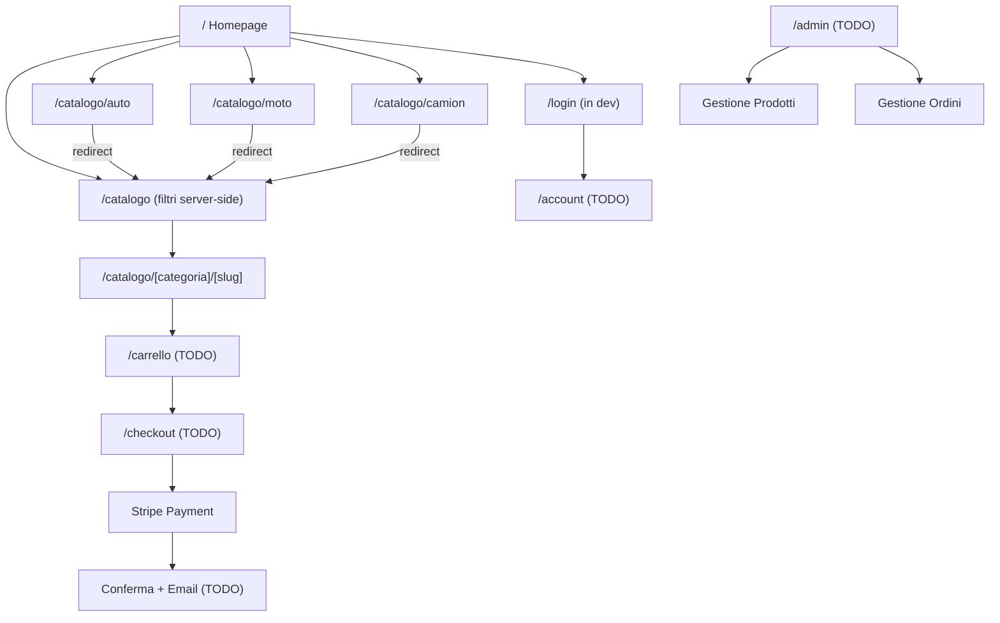
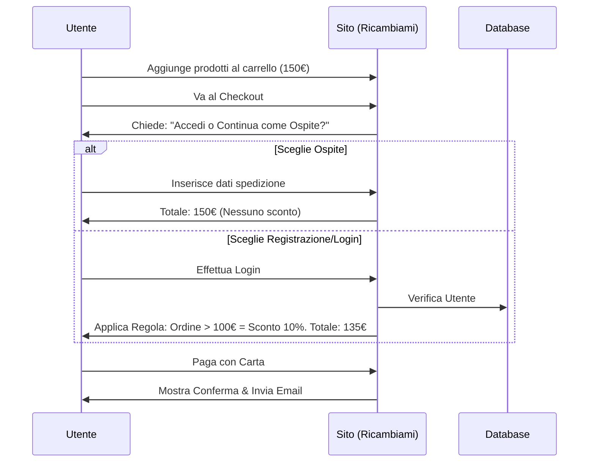

# Architettura e Flusso Utente: Ricambiami.it

Questo documento descrive la struttura logica, l'esperienza utente (User Flow) e il modello dei dati verificato. Tutte le decisioni riportate qui sono aggiornate in tempo reale in base alle tue richieste.

## 1. Mappa del Sito (Sitemap)

### Stato implementazione (VERIFICATO — build ✓)

| Route | Tipo | Stato |
|-------|------|-------|
| `/` | Static | ✅ Implementata |
| `/catalogo` | Dynamic (SSR + searchParams) | ✅ Implementata |
| `/catalogo/auto` `/catalogo/moto` `/catalogo/camion` | SSG → redirect | ✅ Implementata |
| `/catalogo/[categoria]/[slug]` | SSG (24 pagine pre-generate) | ✅ Implementata |
| `/login` | Static | 🔄 In sviluppo |
| `/registrati` | Static | 🔄 In sviluppo |
| `/account` | Dynamic (auth-protected) | ✅ Implementata |
| `/carrello` | Static (client state) | ✅ Implementata |
| `/checkout` | Dynamic (auth + Stripe) | ⬜ TODO |
| `/admin` | Dynamic (auth-protected, role=admin) | ⬜ TODO |

## 2. Esperienza Utente (User Journey)

## 3. Gestione Catalogo Automatica

1. **Sorgente Dati:** I fornitori ci forniscono un file (CSV, XML) o delle API.
2. **Motore di Importazione:** Il backend (Next.js) leggerà questi dati.
3. **Aggiornamento:** Il database (Supabase) si aggiornerà in background per mostrare le disponibilità e i prezzi più recenti.

## 4. Linee Guida di Design: Dark Immersivo (VERIFICATO E IMPLEMENTATO)

Il design inizialmente pianificato come "Apple Minimal light" è stato aggiornato su richiesta a uno stile **dark immersivo** ispirato a Tesla/BMW iX. Di seguito le decisioni verificate e applicate nella codebase.

### 4.1 Palette Colori (Implementata)
| Ruolo | Valore | Dove usato |
|-------|--------|------------|
| Sfondo principale | `#020817` | Hero, sezioni alternate |
| Sfondo secondario | `#030D1A` | Categorie, vantaggi, CTA finale |
| Testo primario | `#FFFFFF` | Titoli |
| Testo secondario | `zinc-400` / `zinc-500` | Descrizioni, link footer |
| Accento / CTA | `#2563EB` | Bottoni, icone, badge, glow |
| Accento chiaro | `#60A5FA` | Testo accento su sfondi scuri |
| Bordi | `white/8` – `white/10` | Navbar, footer, card |

### 4.2 Tipografia (Implementata)
- **Font:** `Inter` (300–700) caricato via `next/font/google`
- **Headline hero:** `text-7xl` / `text-8xl`, `font-bold`, `tracking-tight`
- **Gradient testo:** `linear-gradient(135deg, #2563EB → #60A5FA → #38BDF8)`

### 4.3 Effetti Visivi (Implementati)
- **Particelle 3D:** React Three Fiber — 4.000 punti `PointMaterial` blu, rotazione GPU a 0.04 rad/s. Lazy-loaded client-side (`ssr: false`).
- **Card Tilt 3D:** `perspective(1000px)` + mouse tracking → `rotateX/Y` ±10°. Glow radiale dinamico che segue il cursore.
- **Scroll Reveal:** `IntersectionObserver` con `threshold: 0.15` — slide-up 40px + fade-in 0.7s con `cubic-bezier(0.16,1,0.3,1)`. Delay a cascata tra elementi.
- **Navbar Glassmorphism:** `backdrop-blur-xl backdrop-saturate-150 bg-white/5` — stile iOS, bordo `white/10`, inner glow via `box-shadow`.
- **Glow CTA:** `box-shadow: 0 0 30–40px rgba(37,99,235,0.4)` sui bottoni primari.
- **Transizioni:** `duration-200` / `duration-300` (mai oltre 300ms).

### 4.4 Librerie UI (Installate e Verificate)
| Libreria | Versione | Uso |
|----------|----------|-----|
| `three` | latest | Engine 3D |
| `@react-three/fiber` | latest | React renderer per Three.js |
| `@react-three/drei` | latest | Helper (`Points`, `PointMaterial`) |
| `lucide-react` | preinstallato | Icone SVG (strokeWidth 1.5–1.75) |
| `tailwindcss` | v4 | Styling utility-first |
| `shadcn/ui` | preinstallato | Componenti base (button, ecc.) |

### 4.5 Regole di Consistenza (da seguire su tutte le pagine)
- Sfondo sempre `#020817` o `#030D1A` — **mai** bianco o grigio chiaro
- Icone: sempre da `lucide-react`, `strokeWidth={1.5}` o `1.75`, mai emoji
- Bordi: sempre `border-white/8` o `border-white/10` — mai `border-zinc-*`
- Hover: `hover:text-white`, `hover:bg-white/5` — feedback sempre presente
- `cursor-pointer` su ogni elemento cliccabile

## 5. Architettura dei Pagamenti (Raccomandazione Boilerplate)

Hai chiesto un consiglio su quale boilerplate utilizzare per i pagamenti in futuro. Per uno stack Next.js + Stripe, ti consiglio caldamente due opzioni:
1. **Next.js Enterprise Boilerplate (o Vercel Commerce):** È lo standard d'industria. Supporta nativamente Stripe e flussi e-commerce avanzati.
2. **Taxonomy (di Shadcn):** È un boilerplate open-source scritto dallo stesso creatore dei nostri componenti grafici. Ha un'integrazione Stripe eccellente, pulita e minimale, perfetta per il nostro stile. *Questa è la mia raccomandazione numero uno.*

Quando arriveremo al momento di integrare i pagamenti, ci ispireremo al codice di Taxonomy per garantire sicurezza e pulizia.
